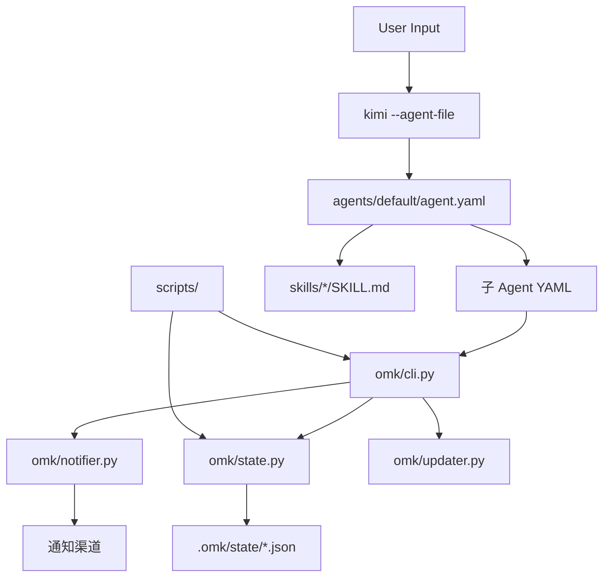

基于 OMK commit: 990ef862c6a7a8c57c7350169be7091354832b23

# OMK 系统设计文档

本文档为 OMK（`Kimi 编排与多智能体协调`，Oh-My-Kimi）的系统设计文档（SYS），
是 `Agent YAML Schema`、`状态 Schema`、`配置项清单`、`工具安全边界与审批机制`
四个关注点的规范源。所有术语须与 `docs/zh/DOC_CONTRACT.md` 的术语表保持一致。

本文档在 `docs/zh/02-architecture.md` 定义的四层架构（`User 层`、`Orchestration 层`、
`Execution 层`、`State 层`）基础上，展开各模块的接口定义、数据流、状态机与持久化细节。

## 1. 模块划分

OMK 的代码库按职责划分为四大物理模块：Python 工具包、Agent 配置、Skill 定义与 Shell 脚本。

### 1.1 `omk/` — Python 工具包

`omk/` 是 `pyproject.toml` 的 `[project]` 段声明的 Python 包，
包含 OMK 运行时所需的状态管理、通知发送与更新检查能力。

| 模块 | 职责 |
|------|------|
| `omk/state.py` | 状态目录的创建、读取、写入与清除，对应 `omk/state.py` 的 `OMK State Manager` docstring |
| `omk/cli.py` | CLI 入口，注册 `omk` 命令并分发至子命令处理函数 |
| `omk/notifier.py` | 封装 Telegram Bot API、Discord Webhook、Slack Webhook 的消息发送逻辑 |
| `omk/updater.py` | 本地版本与远程仓库发布信息的比对，报告更新可用性 |

### 1.2 `agents/` — Agent 配置

`agents/default/` 存放 `根 Agent` 与 18 个公开 `子 Agent` 的 YAML 配置及系统提示词。
`agents/default/agent.yaml` 定义 `根 Agent` 的 `tools` 列表与 `subagents` 注册表，
`agents/default/coder.yaml` 展示 `子 Agent` 通过 `extend` 继承父配置的典型模式。

### 1.3 `skills/` — Skill 定义

`skills/` 下每个子目录对应一个 `Skill`，以 `SKILL.md` 形式组织。
`Skill` 的 `Frontmatter` 包含名称、描述与元数据，
运行时由 `根 Agent` 解析并注入 `系统提示词`。
`Flow Skill` 还通过内嵌节点协议定义多步骤工作流。

### 1.4 `scripts/` — Shell 脚本

`scripts/` 作为 Python 工具层的补充，承担以下职责：
冒烟测试、契约一致性检查、结构化代码搜索、语言服务器诊断、通知发送、速率限制处理与更新检查。
所有脚本执行均受 `Shell` 审批机制约束。

## 2. 模块依赖图

各模块之间的静态依赖关系如下：



`根 Agent` 通过 `--agent-file` 加载后，依据 `Agent Catalog` 将任务委派给 `子 Agent`。
`子 Agent` 在执行过程中可调用 `omk` CLI 或导入 `omk.state` 模块完成状态读写。
`scripts/` 中的脚本既可被 `Shell` 直接调用，也可被 `omk/cli.py` 间接触发。

## 3. 数据流设计

### 3.1 安装时数据流

1. 用户执行 `install.sh`，选择全局、项目本地或指定目录安装模式；
2. 安装器将 `agents/default/` 与 `skills/` 下的文件复制到目标 Kimi 目录；
3. `pyproject.toml` 的 `[project.scripts]` 段确保 `omk` 命令注册至当前 Python 环境；
4. 安装器在结束时输出启动命令示例，引导用户使用 `--agent-file` 加载 `根 Agent`。

### 3.2 运行时数据流

1. **输入解析**：`根 Agent` 接收 `User 消息`，检测是否匹配已加载 `SKILL.md` 的激活条件；
2. **Skill 调度**：若匹配，则将对应 `SKILL.md` 内容注入当前 `会话`，`Flow Skill` 进一步解析节点流转条件；
3. **Agent 委派**：依据任务类型选择 `子 Agent`，通过 `Agent(subagent_type="...", prompt="...")` 发起调用；
4. **工具执行**：`子 Agent` 在独立上下文中执行 `工具调用`，所有文件写入与 `Shell` 命令受 `工具安全边界` 约束；
5. **状态回写**：任务进展、模式激活状态与审计信息写入 `.omk/` 下的对应文件。

### 3.3 状态持久化数据流

`omk/state.py` 的 `write_state()` 采用原子写入策略：
先写入临时文件，再调用 `os.fsync()` 刷盘，最后通过重命名替换目标文件。
读取时若遇到损坏的 `JSON`，返回 `None` 而非抛出异常，确保下游调用方可安全降级。

## 4. 接口定义

### 4.1 OMK CLI 命令接口

`omk/cli.py` 通过 `argparse` 定义三个子命令：

| 子命令 | 参数 | 功能 |
|--------|------|------|
| `omk state` | `read \| write \| clear \| list <mode> [data]` | 读写 `.omk/state/<mode>-state.json` |
| `omk notifier` | `<telegram \| discord \| slack> <message>` | 向指定渠道发送通知 |
| `omk updater` | 无 | 检查远程版本并报告更新可用性 |

### 4.2 Agent YAML 配置接口

`agents/default/agent.yaml` 的 `tools` 列表声明 `根 Agent` 可调用的全部工具，
涵盖 `Agent`、`Shell`、`ReadFile`、`WriteFile`、`StrReplaceFile`、`SearchWeb`、`FetchURL`、
`TaskList`、`TaskOutput`、`TaskStop`、`SetTodoList`、`AskUserQuestion`、`EnterPlanMode`、`ExitPlanMode`、
`Glob`、`Grep`、`ReadMediaFile` 等。

`子 Agent` 通过 `agents/default/coder.yaml` 的 `extend` 继承配置复用父配置，
并借助 `allowed_tools` 与 `exclude_tools` 进行局部覆盖。
`exclude_tools` 必须从继承配置中移除 `Agent`、`AskUserQuestion`、`EnterPlanMode`、`ExitPlanMode`，
以防止 `子 Agent` 嵌套创建或擅自切换审批模式。

核心 Schema 字段如下：

| 字段 | 类型 | 说明 |
|------|------|------|
| `version` | int | 配置格式版本 |
| `agent.name` | str | Agent 显示名称 |
| `agent.system_prompt_path` | str | 系统提示词文件路径 |
| `agent.system_prompt_args` | dict | 注入系统提示词的自定义参数 |
| `agent.tools` | list[str] | 允许调用的工具清单 |
| `agent.exclude_tools` | list[str] | 从继承配置中排除的工具 |
| `agent.extend` | str | 继承的父配置文件路径 |
| `agent.subagents` | dict | 子 Agent 注册表（仅根 Agent） |

### 4.3 Python 状态 API

`omk/state.py` 的 `OMK State Manager` docstring 定义以下公共函数：

| 函数 | 签名 | 行为 |
|------|------|------|
| `get_state_dir()` | `() -> Path` | 获取状态目录，不存在则创建 |
| `read_state(mode)` | `(str) -> dict \| None` | 读取指定模式的状态 |
| `write_state(mode, data)` | `(str, dict) -> None` | 原子写入指定模式的状态 |
| `clear_state(mode)` | `(str) -> bool` | 清除指定模式的状态文件 |
| `list_states()` | `() -> list[str]` | 列出所有存在状态文件的模式 |
| `is_mode_active(mode)` | `(str) -> bool` | 判断模式是否为激活态 |
| `get_active_modes()` | `() -> list[str]` | 获取当前所有激活模式 |

### 4.4 Skill 触发接口

`Skill` 的激活通过两种机制实现：

1. **斜杠命令**：用户输入 `/skill:<name>` 或 `/flow:<name>`，
   `根 Agent` 直接解析命令并加载对应 `SKILL.md`；
2. **触发词匹配**：`根 Agent` 检测 `User 消息` 中的自然语言片段，
   若与某 `Skill` 的 `Frontmatter` 元数据匹配，则自动激活该 `Skill`。

`Skill` 的 `Frontmatter` 须包含 `name` 与 `description` 字段，
当多个匹配同时发生时采用最长匹配优先策略。
`Flow Skill` 还须定义节点间的流转条件与终止判定逻辑。

## 5. 状态机设计

### 5.1 持久循环状态机

该模式对应一种持续执行直至任务完成的工作流。其状态转移如下：

```
[空闲] --(用户请求)--> [执行中]
[执行中] --(完成并通过验证)--> [空闲]
[执行中] --(完成但验证失败)--> [重试等待]
[重试等待] --(自动重试)--> [执行中]
[执行中] --(用户取消)--> [取消]
```

状态文件 `.omk/state/<mode>-state.json` 中的 `active` 字段标识当前阶段：
`true` 表示处于 `[执行中]` 或 `[重试等待]`，`false` 表示 `[空闲]` 或 `[取消]`。
每次迭代完成后，状态文件中须记录当前进度、失败原因与已尝试次数，
以便中断后恢复上下文。

### 5.2 共识规划模式状态机

该模式通过多视角验证生成结构化方案，状态机如下：

```
[空闲] --(启动规划)--> [Planner 阶段]
[Planner 阶段] --(规划完成)--> [Architect 评审]
[Architect 评审] --(通过)--> [Critic 审计]
[Architect 评审] --(未通过)--> [Planner 阶段]
[Critic 审计] --(通过)--> [综合完成]
[Critic 审计] --(未通过)--> [Planner 阶段]
[综合完成] --(保存方案)--> [空闲]
```

在共识规划模式下，`根 Agent` 的角色严格限定为协调者与综合者，
禁止直接创建规划内容或执行实现代码。
各阶段的产出保存至 `.omk/plans/`，状态文件同步记录当前阶段与待办项。

## 6. 持久化设计

OMK 在项目目录的 `.omk/` 下建立以下持久化结构：

| 路径 | 格式 | 用途 | 写入方 |
|------|------|------|--------|
| `.omk/state/*.json` | JSON | 模式状态文件，文件名遵循 `<mode>-state.json` | `omk/state.py` |
| `.omk/state/sessions/` | JSON/目录 | `会话` 跟踪元数据，保存分支、worktree 与任务进度 | `omk/state.py` |
| `.omk/notepad.md` | Markdown | `记事本`，持久化笔记与临时结论 | `WriteFile` / `StrReplaceFile` |
| `.omk/project-memory.json` | JSON | `项目记忆`，跨会话的可复用知识与术语表 | `omk/state.py` |
| `.omk/plans/` | Markdown | 规划文档，存放结构化方案 | `WriteFile` |
| `.omk/wiki/` | Markdown | `知识库`，分层组织的文档集合 | `WriteFile` / `StrReplaceFile` |
| `.omk/logs/` | 文本/JSON | 审计日志，记录关键操作与 `Agent` 委派历史 | `Shell` / `WriteFile` |

状态文件采用人类可读的文本格式，便于调试与版本控制。
`项目记忆` 与 `记事本` 使得多次 `会话` 之间能够继承已确认的结论与风格指南。
规划文档目录支持版本控制与团队协作。

## 7. 错误处理与日志

### 7.1 冒烟测试

`scripts/smoke-test.sh` 在安装后执行以下验证：

1. 所有 `agents/default/*.yaml` 的 YAML 语法正确性；
2. 已安装的 Agent 配置文件完整性与公开文件清单匹配；
3. 已安装的 `Skill` 数量与预期一致；
4. `kimi` CLI 可用性及 `agent.yaml` 可被正常解析。

测试失败时脚本以非零退出码返回，并输出具体错误项。

### 7.2 契约一致性检查

`scripts/check-agent-contract.py` 作为持续集成的一环，
验证以下对象之间的一致性：

- `agents/default/agent.yaml` 的 `subagents` 注册表；
- `README.md` 的 `Agent Catalog` 表格；
- `agents/default/system.md` 的 `Agent Catalog` 章节；
- `skills/omk-reference/SKILL.md` 的代理清单；
- `install.sh` 与 `uninstall.sh` 中的文件清单；
- 各 `SKILL.md` 中的 `Agent(subagent_type="...")` 引用合法性；
- `Skill` 分类统计与描述对齐。

该脚本在检测到漂移时输出差异详情并以退出码 `1` 失败，
确保文档、注册表、安装器消息和技能引用保持同步。

### 7.3 运行时错误处理

- `omk/state.py` 的 `read_state()` 在文件不存在或 `JSON` 损坏时返回 `None`，
  调用方须显式处理空状态；
- `omk/cli.py` 在参数缺失或子命令未知时打印用法说明并返回退出码 `1`；
- `scripts/notify.sh` 在通知渠道配置缺失时跳过发送并记录警告；
- `scripts/lsp-diagnostics.sh` 在语言服务器未就绪时以非零码退出，提示用户检查环境。

本文档使用的所有术语定义、事实清单与引用规范详见 `docs/zh/DOC_CONTRACT.md`。
若事实清单中的客观数据发生变更，须同步更新 `DOC_CONTRACT.md` 并重新生成本文档的 `omk-commit`，
随后运行 `scripts/check-agent-contract.py` 验证一致性。
